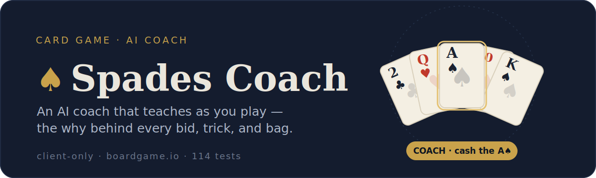
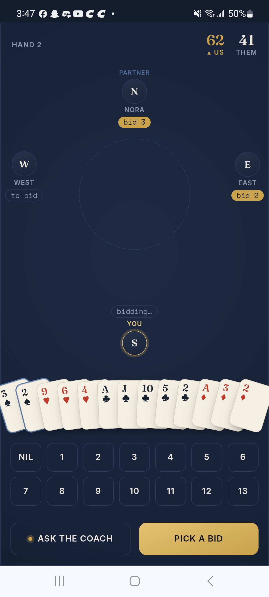
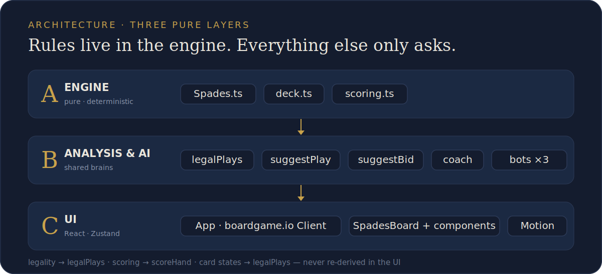
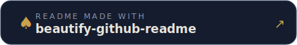

<p align="center">
  
</p>

<p align="center">
  
  
  
  
  
  
</p>

**Spades Coach** is a fully client-side (no server) game of [Spades](https://en.wikipedia.org/wiki/Spades_%28card_game%29) — you and an AI partner versus two AI opponents — with a coach that explains the *why* behind every decision. Ask for advice on any bid or play and it tells you **what to do and the reasoning**, drawing on the exact same analysis the bots use. It never plays for you; it teaches.

<p align="center">
  
</p>

## Features

- 🃏 **Full Spades ruleset** — bidding, follow-suit, breaking spades, 13-trick hands, scoring to 200 (Bicycle rules).
- 🎯 **Nil & Blind Nil** — including the 3-card partner exchange.
- 🧠 **A coach that counts cards** — spots your sure winners and tells you to cash them and keep the lead, when to duck, and warns you before you rack up bags.
- 🤖 **Three bot difficulties** — Beginner / Intermediate / Expert, all sharing the coach's brain.
- 📊 **Transparent scoring** — an itemised end-of-hand summary shows exactly how each side's points moved (contract, bags, Nil, sandbag penalty).
- 🏆 **Trick-winner reveal** — finished tricks linger with the winning card highlighted, so you can follow the play.
- 🎴 **Auto-sorted hand** — alternating suit colours, high→low, always tidy.
- 📱 **Mobile-first, installable PWA** — a 9:16 "night-parlor" interface with a fanned-card hand and a compass-rose table.
- ♿ **Accessible** — visible focus rings, ≥44px hit targets, colour is never the only signal, `prefers-reduced-motion` respected.

## How it works

The golden rule: **rules live in the engine; everything else asks the engine and never re-derives them.** Three strict layers, with a pure core that imports no framework.

<p align="center">
  
</p>

- **Engine** (`src/game/`) — the authoritative, deterministic rules + state machine. `deck.ts` and `scoring.ts` are framework-free pure modules (a purity test proves they import no React or boardgame.io).
- **Analysis & AI** (`src/analysis/`, `src/ai/`) — pure helpers (`legalPlays`, `suggestBid`, `suggestPlay`, `coach`) shared by **both** the bots and the coach, so advice and play always agree.
- **UI** (`src/ui/`, `src/store/`, `src/App.tsx`) — a React view over the boardgame.io client, with a Zustand store for UI-only state.

Determinism comes from a seed + boardgame.io's random plugin: a given seed and difficulty always reproduce the same game, which keeps the rules honest and the tests fast.

## Tech stack

| Concern | Choice |
| --- | --- |
| Language | TypeScript |
| Game engine | [boardgame.io](https://boardgame.io/) |
| UI | React 18 |
| State (UI only) | Zustand |
| Animation | Motion (`motion/react`) |
| Build / dev | Vite |
| Tests | Vitest + Testing Library + happy-dom |
| Deploy | Docker (multi-stage) → nginx |

## Quick start

Requires **Node.js 20+** (the Docker image builds on Node 22).

```bash
git clone git@github.com:sruckh/spades-coach.git
cd spades-coach
npm install
npm run dev          # Vite dev server → http://localhost:5173
```

### Scripts

```bash
npm run dev          # Vite dev server
npm run build        # production build → dist/
npm run preview      # preview the production build
npm run test         # Vitest (watch)
npm run test:run     # Vitest (one-shot)
npm run lint         # ESLint over src + tests
npm run typecheck    # tsc --noEmit
npm run format       # Prettier
```

**The gate** — all four must pass before a change is done:

```bash
npm run typecheck && npm run test:run && npm run lint && npm run build
```

## Testing

114 tests cover the engine (deal / bidding / play / scoring), the analysis layer (legal plays, bid & play suggestions, the card-counting coach), all three bot tiers across many seeded full games, and the UI (card states, legal-tap handling, scoreboard). A dedicated **purity test** asserts the engine's pure modules never import React or boardgame.io.

```bash
npm run test:run                                       # everything
npx vitest run tests/spades.test.ts                    # one file
npx vitest run tests/spades.test.ts -t "follow-suit"   # one test
```

## Deployment

A multi-stage Docker build compiles the static bundle and serves it from `nginx:alpine`:

```bash
docker compose up -d --build
```

The container exposes no host ports — it joins an external `shared_net` and is meant to sit behind a reverse proxy that terminates TLS and forwards `https://<your-domain>` → `http://spades:80`. The app is an installable PWA with an offline-capable service worker.

## Project structure

```
src/
  game/        Engine — pure rules (Spades.ts, deck.ts, scoring.ts)
  analysis/    legalPlays, suggestBid, suggestPlay, coach, handEval
  ai/          bots (Beginner / Intermediate / Expert)
  tutor/       out-of-game lessons & drills
  ui/          React components (board, hand, coach sheet, summary…)
  store/       Zustand UI-only store
  types.ts     shared domain types
tests/         Vitest suites
public/        PWA icons, manifest, service worker
Dockerfile     multi-stage build → nginx
```

## How Spades scores (quick primer)

- **Make your contract** (tricks bid by both partners): **+10 × bid**.
- **Overtricks are "bags":** +1 each now, but every **10 accumulated bags = −100** (the sandbag penalty). Don't grab tricks you don't need.
- **Set** (miss the contract): **0** points.
- **Nil** (bid 0, take no tricks): **±100**; **Blind Nil**: **±200**.
- First partnership to **200** wins.

## License

[Apache-2.0](./LICENSE) © 2026 sruckh.

<p align="center">
  <a href="https://github.com/oil-oil/beautify-github-readme"></a>
</p>
